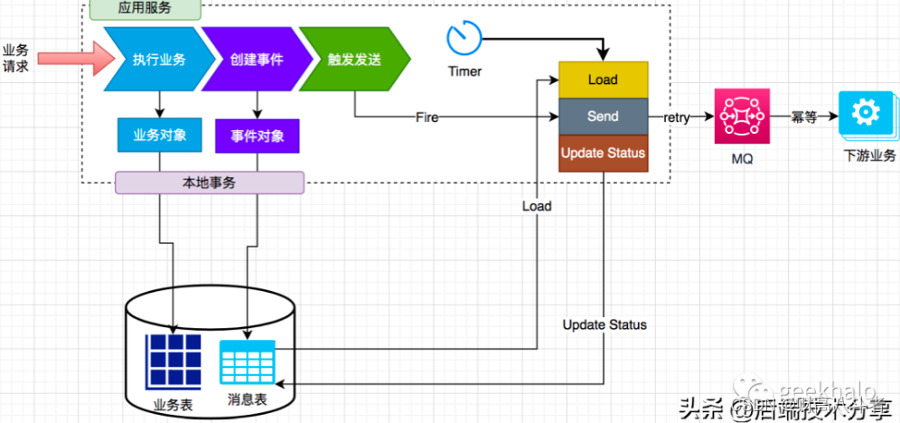

# Sender Starter

通过本地表发送事务消息

要在你的业务库中创建如下表，最好定期归档。

```sql

create table MACULA_MSG
(
    id           bigint auto_increment primary key,
    orderly      tinyint      not null comment '是否为顺序消息',
    topic        varchar(64)  not null comment 'MQ topic',
    sharding_key varchar(128) not null comment 'ShardingKey，用于选择不同的 partition',
    tag          varchar(128) not null comment 'Message Tag 信息',
    msg_id       varchar(64)  not null comment 'Msg ID 只有发送成功后才有数据',
    msg_key      varchar(64)  not null comment 'MSG Key，用于查询数据',
    msg          longtext     not null comment '要发送的消息',
    retry_time   tinyint      not null comment '重试次数',
    status       tinyint      not null comment '发送状态:0-初始化，1-发送成功，2-发送失败',
    create_time  datetime     not null,
    update_time  datetime     not null,
    index        idx_update_time_status(update_time, status)
)
```

可以使用相关API进行消息处理：

- ReliableMessageSender#send 在业务方法中使用，执行可靠消息发送；
- ReliableMessageCompensator#compensate 周期性调度，对未发送或发送失败的消息进行补充；
  

使用方法

```yaml
macula:
  sender:
    message-table: 你的表名 # 默认是MACULA_MSG
```

RocketMQ的配置可以参考 macula-boot-starter-rocketmq

```java
import cn.hutool.core.date.DateUtil;
import dev.macula.boot.starter.sender.ReliableMessageSender;
import org.apache.commons.lang3.time.DateUtils;

// 在事务方法中，执行完业务逻辑后，调用MessageSender
@RequiredArgsConstructor
public class OrderService {
    private ReliableMessageSender sender;

    private ReliableMessageCompensator compensator;

    @Transactional
    public void createOrder(OrderDTO order) {
        doBusiness();
        sender.send(buildMessage(order));
    }

    private Message buildMessage(OrderDTO order) {
        Message message = Message.builder()
                .msg(JSONUtil.toJsonStr(order))
                .orderly(true)
                .shardingKey("123")         // 用来数据分区的，暂时没有用
                .msgKey(order.getOrderNo()) // 用订单号，发送顺序消息时有用
                .topic("test_topic")
                .tag("tag")
                .build();
        return message;
    }

    // 下面方法应该定时调度，用户未成功发送消息的补充发送
    public void compensator() {
        compensator.compensator(DateUtil.addSeconds(new Date(), -120), 100);
    }
}
```